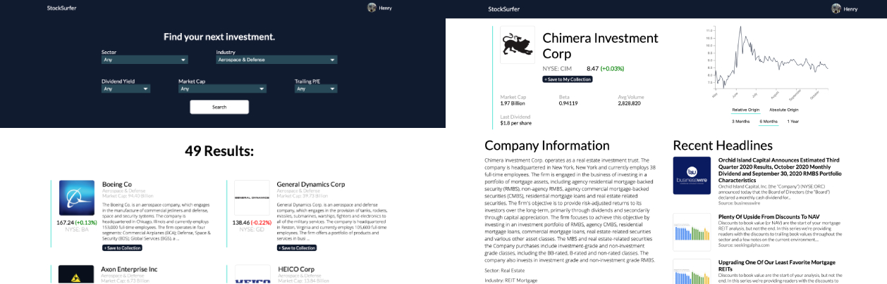
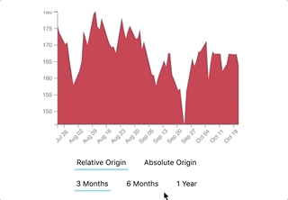

# Surf the Market.
## StockSurfer is a stock screener designed for retail and DIY investors.

StockSurfer is a full-stack web app built using **React, Express, and MongoDB.**  
The app also uses **d3.js** for visualization and **Passport.js with OAuth 2.0** for authentication.

StockSurfer lets users browse through stocks that fit their desired criteria. After  
signing in, users can save stocks to their personal collection for later review.

StockSurfer uses d3.js to dynamically display price movement.

  
See live hosted app at https://stock-surfer.netlify.app

## Description

Stock screeners generally return an immense amount of quantitative data that can be difficult to decipher for retail investors. 

Here is an example of a typical stock screener output:

While reviewing stocks strictly by technical or fundamental measures can be useful for institutional investors, most retail investors instead seek out companies to invest in based on stories, branding, and belief in their products. Because of this, stock screeners are largely ill-suited for use by non-professional investors; their outputs provide little if any insight into the subjective qualities that retail investors look for. Many retail investors do not assess technical or fundamental measures of the stocks they invest in at all.

I envisioned a stock screener output that would allow a user to input their desired criteria - just like a stock screener - and then browse stocks by their non-quantitative attributes. StockSurfer is my proof-of-concept for this idea.

Here is an example output row from StockSurfer:

## Database Model

StockSurfer uses MongoDB for storage of user data.

    {
      "_id": {
        "$oid": "5f88a8a4003d71065df02c68"
      },
      "stocks": [
        "AAPL",
        "NFLX",
        "MSFT"
      ],
      "userId": "101154829380773895726",
      "displayName": "Henry",
      "email": "henry@example.url",
      "image": "https://abc.googleusercontent.com/example-image-url",
      "__v": {
        "$numberInt": "0"
      }
    }

## Resources
Technology: React, d3.js, Express, MongoDB  
APIs: [Financial Modeling Prep](https://financialmodelingprep.com), [Finnhub](https://finnhub.io/)   
Note: StockSurfer is a proof-of-concept and uses data scraped from [Finviz.com](https://finviz.com).
